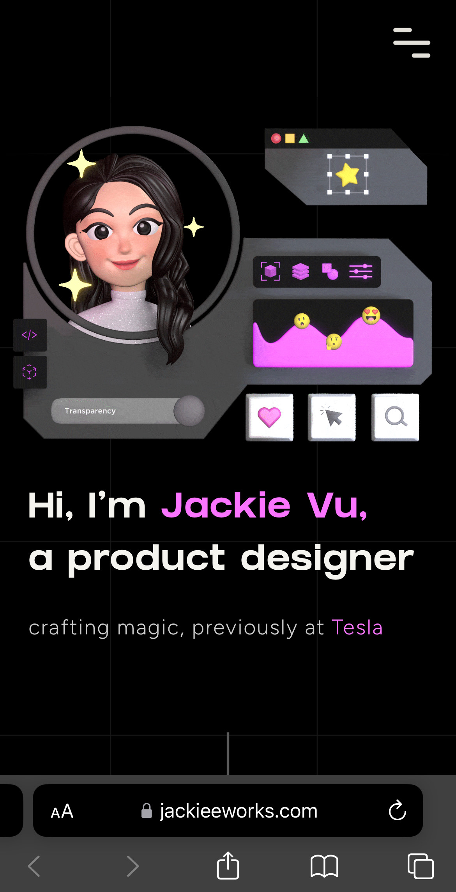
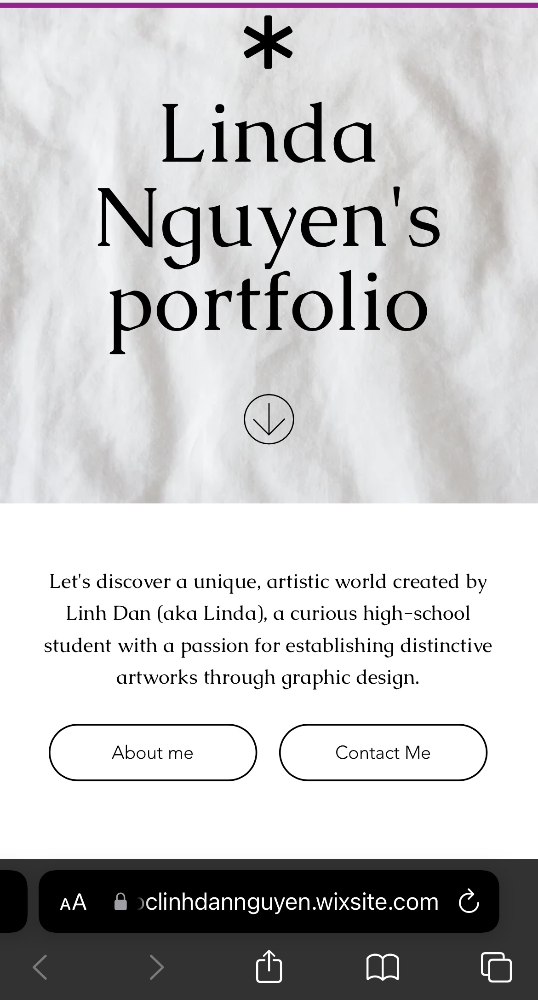

# Project 1, Milestone 1: Design Journey

[← Table of Contents](design-journey.md)

**Replace ALL _TODOs_ with your work.** (There should be no TODOs in the final submission.)

Be clear and concise in your writing. Bullets points are encouraged.

Place all design journey images inside the "design-plan" folder and then link them in Markdown so that they are visible in Markdown Preview.

**Everything, including images, must be visible in _Markdown: Open Preview_.** If it's not visible in the Markdown preview, then we can't grade it. We also can't give you partial credit either. **Please make sure your design journey should is easy to read for the grader;** in Markdown preview the question _and_ answer should have a blank line between them.

## Website Topic
> Briefly explain what your website will be about. Share your vision of your personal website. (1 sentence)

My personal website is mainly a place for me to introduce my research/internship experiences and skills in psychology and mention my interests outside the academic realm.

**New plan**
My personal website is a place for me to introduce my research interests, skills, research/internship experiences, and coursework in psychology.

## Personal Website Design Exploration

> Identify two personal websites (preferably static websites) that exist today on the web. You will be drawing inspiration from these sites for your own site; **please select websites that are similar to the website you wish to create**. You may not use the instructor's website or template websites for this part; the example websites should be real personal websites that exist on the web.
>
> Include a **mobile** screenshot of the home page for each site. (If you're taking a screenshot on your laptop, resize your browser window to a mobile size before taking the screenshot.)

**We'll refer to these are your "example websites."**

### Personal Website 1 Review

<https://www.jackieeworks.com>

- Who do you think this site is designed for? Who is its intended audience?

   I think this site is designed for employers interested in hiring UX designers.

- What **goals** do you think the audience likely has when visiting this site?

   They want to look closely at her past projects and the corresponding UX products. Based on them, employers can identify the skills and experiences she has that may be suitable with their qualifications.

- What **content** is included in this personal website?

    Her personal website includes her projects along with their descriptions & images, characters featured in her projects, her basic information (introduction, honors & awards, and skills), and her contact information (Linkedin, Instagram, Email).

- Do you believe the content likely **addresses** the goals of the site's audience?

    Yes, I think the content addresses the goals of the site's audience extremely well because they can gain many insights about her skills from detailed descriptions of her design process, features of the applications, user feedback, and achievements for each project.

- What do you like about the design?

    The content is very well-structured and straightforward; there are clear headings & subheadings and the content is usually accompanied with related images, making it easier for audiences to understand her points. Additionally, she uses her self-designed characters that looks appealling and she sets the contrast, opacity, transparency properties pretty well, which makes her website readable and professional.

### Personal Website 2 Review

<https://ngoclinhdannguyen.wixsite.com/lindanguyenportfolio>

- Who do you think this site is designed for? Who is its intended audience?

    Since she is a high school student, I think the intended audience is the design departments in high school clubs or organizations.

- What **goals** do you think the audience likely has when visiting this site?

    They want to view the designs she has made and her flexibility in designing for different fields so that they can determine if she's a suitable applicant.

- What **content** is included in this personal website?

    Her personal website includes her design works for several projects, her introduction, design journey, and contact information.

- Do you believe the content likely **addresses** the goals of the site's audience?

    Yes, because she always briefly introduces the project, demonstrates her design decisions to fit with the theme/goal of each project, and features some of her designs.

- What do you like about the design?

    I like how she organizes different designs to their corresponding projects (looks like different files in their corresponding folders) and labels each design with a short description below, which helps the audience follow her contents and stories more easily. Another feature that interests me is a timeline of her design journey; it can show design recruiters of high school clubs her growth and diverse experience in design and leadership.

## Audience
> Briefly explain who the intended audience is for your website. (1 sentence)

My intended audience is psychology researchers interested in hiring research assistants for their projects.

## Audience Goals
> Why would your audience visit your site?

They would want to visit my site because they can learn about my research experiences and skills in psychology, thus determining if I'm suitable to be a part of their project.

> Identify at least 3 goals that your users have for visiting your website.

1. They want to know my research focus and which aspects of psychology I am interested or experienced in.

2. They want to know the skills I have developed through each research project such as skills in statistics, data visualization, literature review.

3. They want to look at the deliverables and outcomes of each project to determine its applicability and my efficiency.

## Audience Reflection
> Your audience should be a **cohesive** group of people with similar goals.
> Your audience should not be overly broad. (i.e. "recruiters")
> Your audience should not be arbitrary specific. (i.e. "recruiters located in midtown NYC")
> Your audience should describe a group of people who have the same goals.
>
> Explain why your audience is a cohesive group of people with uniform goals. (1-2 sentences)

Psychology researchers is a cohesive group of people with uniform goals because they often recruit undergraduates to be research assistants for their studies. From the website, they can determine whether the skills and experiences of the applicant may prove useful to their specific projects.

## Content Reflection
> Review the example website's content for inspiration.
> Review your audience's goals.
> Identify the content your audience would need to achieve their goals.

- Introduction about myself (GPA, research interests, computer skills, languages, quote)
- My projects/internships along with their descriptions (organized in a reverse chronological order)
- My responsibilities in each project/internship
- Skills I developed/used in each project/internship
- Deliverables in each project/internship if possible
- Basic information about myself (origin, education, research interests)
- My CV
- A section for my hobbies
- Contact information (Email, Linkedin, Instagram)

**New plan**
There won't be a section for my hobbies. However, there will be a section for my research interests, where they are illustrated in more details. Additionally, there will also be a section for my coursework as it reflects my knowledge and skills. Psychological researchers often look at the coursework to consider hiring research assistants as well. My CV is also substituted with my resume.

## Planned Content
> List **all** the content you plan to include in your personal website.
>
> **Do not include your actual content here!** (All content should be located in the `design-plan/m1-content` folder.)
> Simply provide a **very short description** of each piece of content.
>
> Examples:
>
> - headshot image
> - bio paragraph
> - PDF of class schedule
> - screenshot of main app screen of XYZ project
>
> You should list all types of content you planned to include (i.e. text, photos, images, etc.)

- Headshot in the homepage
- Big heading of my name
- Headline
- Navigation links to tabs
- 2-3 sentences introducing myself
- A list of bullet points (GPA, research interests, computer skills, languages)
- A quote that reflects my perspective on research
- Cornell Phonetics Lab
  - A short sentence for an overview of my work in the project
  - Homepage image reflecting the research topic
  - More detailed description paragraph about the lab and the project
  - Bullet points about my responsibilities
  - Keywords for skills used
  - Images of software used, flyers for participant recruitment
- Research Project with Professor Shimon Edelman:
  - A short sentence for an overview of my work in the project
  - Homepage image reflecting the research topic
  - More detailed description paragraph about the project
  - Bullet points about my responsibilities
  - Keywords for skills used
  - Images of software used
- Clinical Psychology Unit (Department of Neurology, University Medical Center HCMC):
  - A short sentence for an overview of my work in the internship
  - Homepage image of psychiatrist and patients
  - More detailed description paragraph about the unit and the internship
  - Bullet points about my responsibilities
  - Keywords for skills/knowledge learned
  - Image of the hospital
- Psychology Independent Research Project with Dr. Lauren Grant
  - A short sentence for an overview of my work in the project
  - Homepage image reflecting the research topic
  - Description paragraph about my independent research project
  - Bullet points about my responsibilities
  - Keywords for skills used & knowledge learned
  - Link to my research paper
  - Screenshot of the first page of my research paper
- Brain Health Lab (School of Biomedical Engineering, International University)
  - A short sentence for an overview of my work in the project
  - Homepage image reflecting the research topic
  - Description paragraph about my independent research project
  - Bullet points about my responsibilities
  - Keywords for skills used & knowledge learned
  - Image of my scientific poster, software used
- About me paragraph
- Link to my CV
- Short paragraphs about my hobbies
- 1-3 images each for my volunteering project, cultural preservation project, and singing performances
- Links to Email, Linkedin, and Instagram
- Elements related to psychology for decorations
- Copyright mark

**New plan**
There will be no content related to my hobbies. However, there will be paragraphs elaborating my research interests. Additionally, there will also be lists of my coursework organized into each semester. Since it also reflects a student's knowledge and skills, psychological researchers often look at the coursework to consider hiring research assistants. Also, I will not include the images of the software used and the hospital of my internship because I think it's better not to cite so many sources on my personal website. My CV is also substituted with my resume because it would be more condensed.

## Content Justification
> Explain why this content is the right content for your site's audience and how the content addresses their goals.

Each of my research projects/internships has a different nature so detailing descriptions of the project and my corresponding responsibilities would give better insights into my experiences and skills. The audience will better understand what the purpose of the project is, what I specifically do, what skills I acquire, what knowledge I gain for a particular area of psychology, and what results I deliver. Keywords will reiterate and summarize my skills and knowledge used/gained from each project, and links/images will complement my text descriptions, facilitating the understanding of the audience.

Initially, I didn't plan to include short bullet points of my GPA, research interests, computer skills, and languages + overviews of my experience in the homepage. However, I think if the audience visits the site for the first time and they just want a glimpse of my profile, putting such bullet points and overviews there will give them a good impression, urging them to know more about me. I also included my CV in the "About Me" section because I want them to first gain a deeper understanding of my work through the "My Experience" section, rather than relying solely on some bullet points. Although much of my content is about psychology, there will also be a section for  my hobbies because I believe sometimes people can connect with each other through similar interests too beyond the academic/professional life.

**New plan**
Since the section about personal hobbies doesn't align with the goals of my audience, I decided to delete that section. However, I will include detailed sections about my research interests and coursework because I think psychology researchers may want to know how passionate I am about the research fields I'm working on. They may judge how knowledgeable I am about the subjects, and how willing I am to pursue those fields, possibly as well as their research projects. Additionally, I will include my resume in the homepage because I think that psychology researchers are quite busy, so if they don't have the time to view my website entirely, they can still have an overview of me by going to that link.

## Home Page Content
> What is the content that your users would expect when visiting your site for the first time.
> **List** what content you will include on the homepage.

- Big heading of my name
- Headline
- Navigation links to tabs
- 2-3 sentences introducing myself
- A list of bullet points (GPA, research interests, computer skills, languages)
- A quote that reflects my perspective on research
- My projects/internships, each accompanied by a short description. They are also each accompanied by a button for users to view them in more detail.
- Copyright mark
- Contact information (Email, LinkedIn, Instagram)

**New plan**
I'll have 5 sentences introducing myself. There won't be a section for my projects/internships because I decided to move them all in the "Research/Internship Experience" later. That way, the content won't be repetitive and make it easier for the audience to view the whole content all at once. Instead, I will have short paragraphs demonstrating my research interests in the homepage. I will also include a link to my resume in the list of bullet points.

## References

### Collaborators
> List any persons you collaborated with on this project.

### Reference Resources
> Did you use any resources not provided by this class to help you complete this assignment?
> Cite any external resources you referenced in the creation of your project. (i.e. W3Schools, StackOverflow, Mozilla, etc.)
>
> List **all** resources you used (websites, articles, books, etc.), including generative AI.
> Provide the URL to the resources you used and include a short description of how you used each resource.

I used these websites for inspiration:

- <https://www.jackieeworks.com>
- <https://ngoclinhdannguyen.wixsite.com/lindanguyenportfolio>

I used these images to illustrate some of my work:

- <https://images.sftcdn.net/images/t_app-icon-m/p/160b7644-96d7-11e6-9578-00163ec9f5fa/2419115568/praat-logo.png>
- <https://arts.unimelb.edu.au/__data/assets/image/0008/2263067/elan-logo.jpg>
- <https://khdt.edu.vn/wp-content/uploads/2022/12/toa-nha-bv.jpg>
- <https://cdn.graphpad.com/assets/0.91.0/images/logo/logo-prism-white.svg>

I also used Canva to create some of my images.

**New plan**: I won't include the images of the software used and the hospital of my internship because I think it's better not to cite so many sources on my personal website.

[← Table of Contents](design-journey.md)
