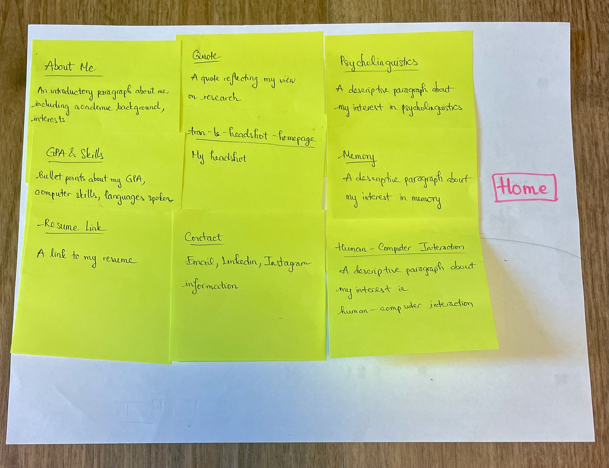
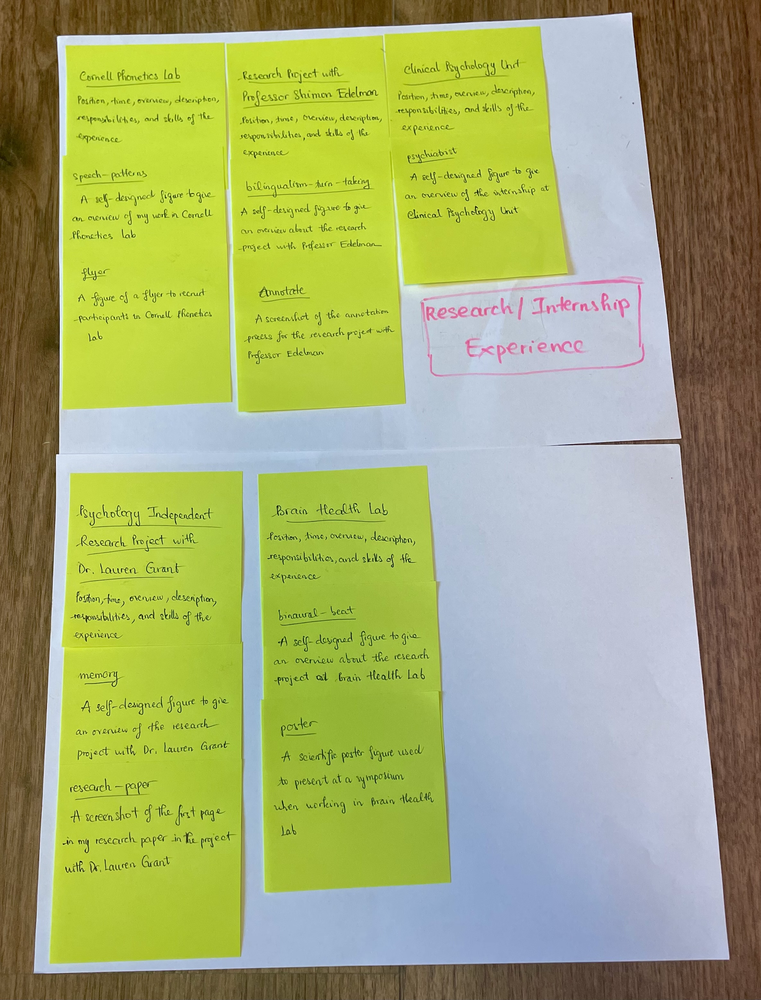
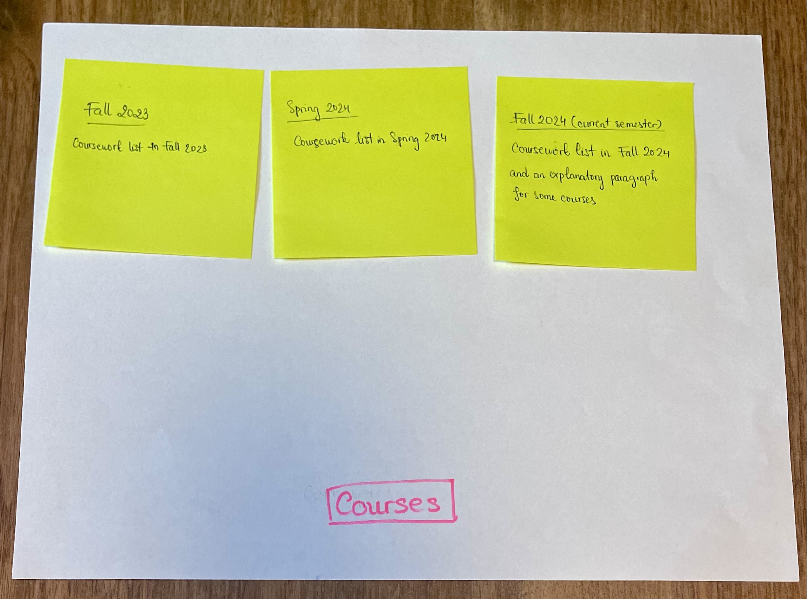
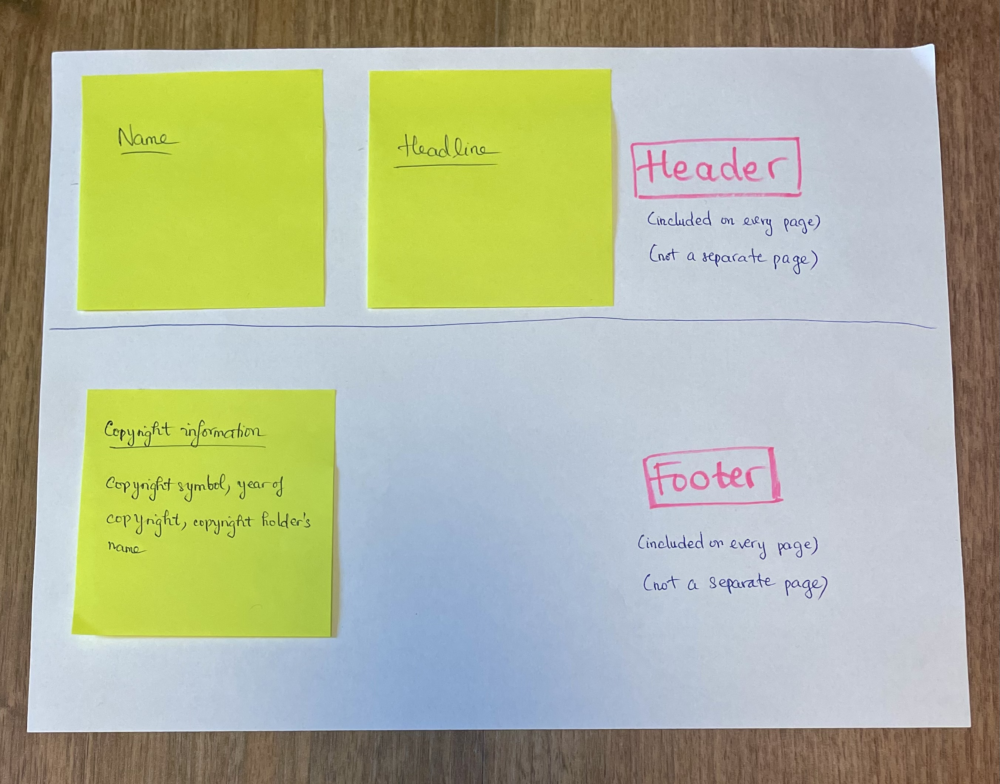
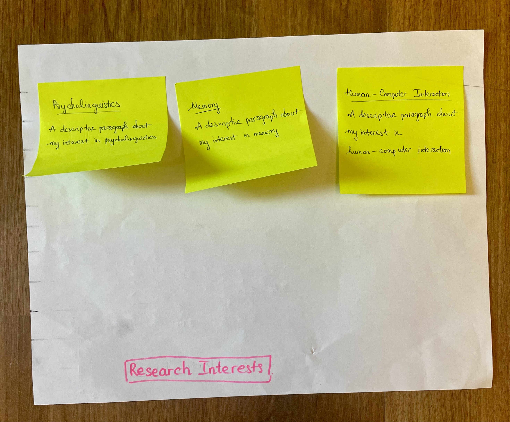
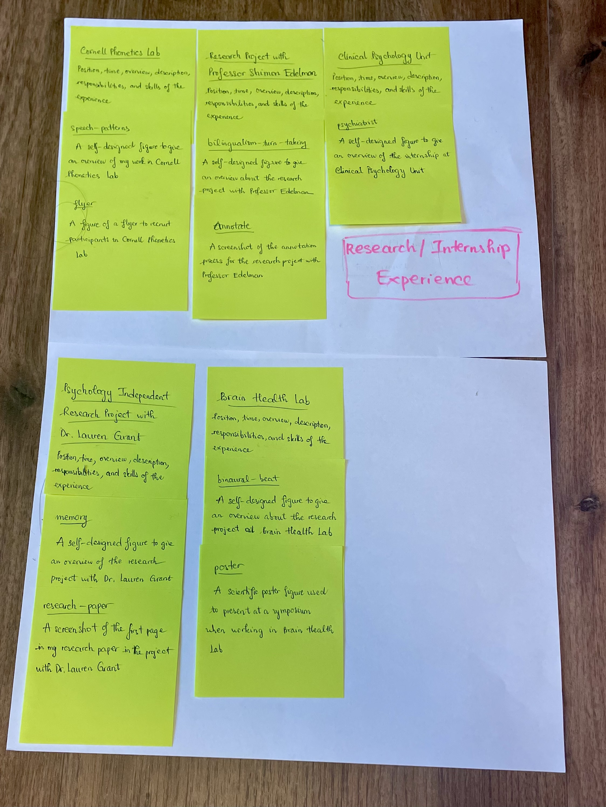
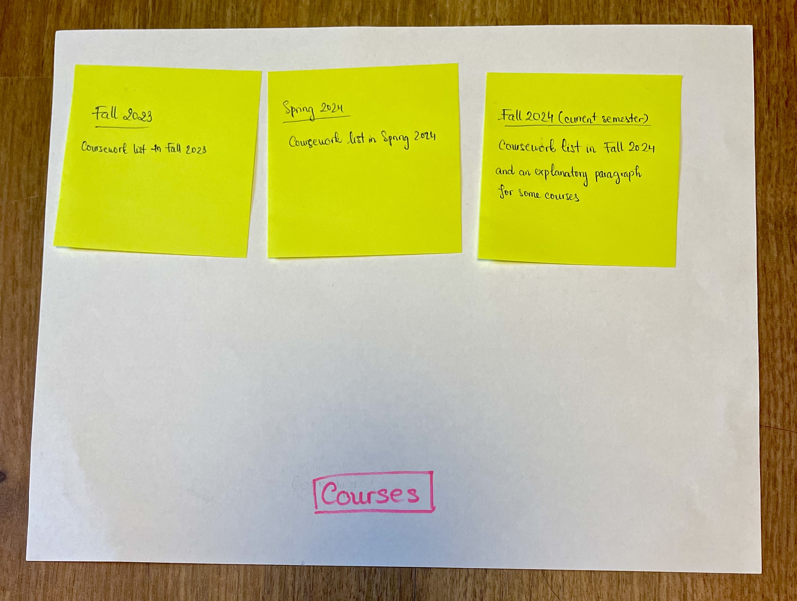
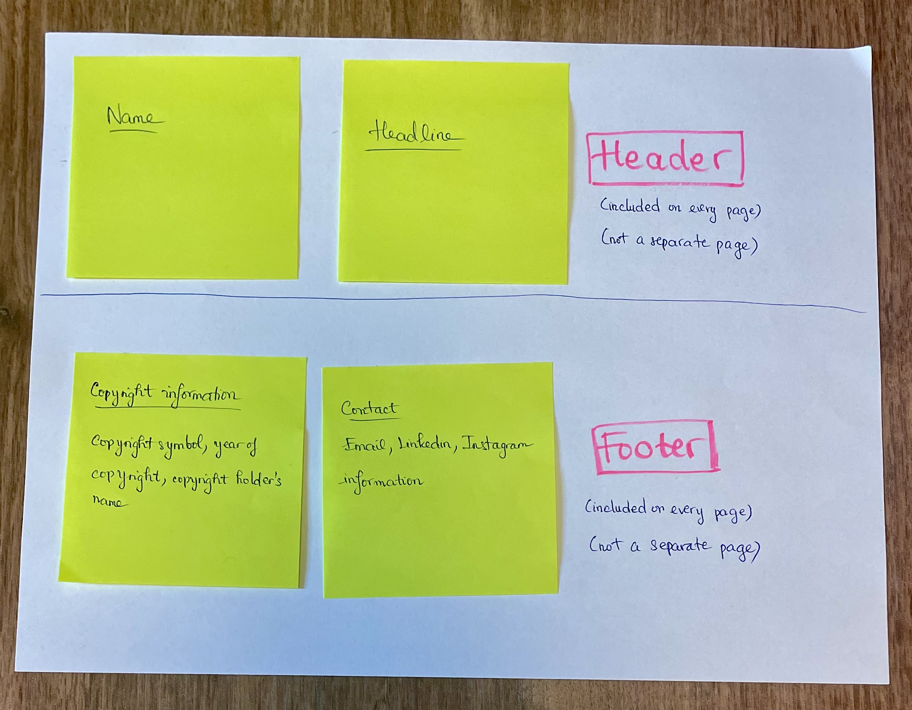

# Project 1, Milestone 3: Design Journey

[← Table of Contents](design-journey.md)

**Replace ALL _TODOs_ with your work.** (There should be no TODOs in the final submission.)

Be clear and concise in your writing. Bullets points are encouraged.

Place all design journey images inside the "design-plan" folder and then link them in Markdown so that they are visible in Markdown Preview.

**Everything, including images, must be visible in _Markdown: Open Preview_.** If it's not visible in the Markdown preview, then we can't grade it. We also can't give you partial credit either. **Please make sure your design journey should is easy to read for the grader;** in Markdown preview the question _and_ answer should have a blank line between them.

## Milestone 2 Feedback Revisions
> Explain what you revised in response to the Milestone 2 feedback (1-2 sentences)
> If you didn't make any revisions, explain why.

I didn't make any revisions because I didn't get my points deducted for any criteria.

## Information Architecture

Design the information architecture for all the pages your website.

You may change your homepage content based on your card sorting. If you do change the homepage content, you don't need to go back to the previous milestone design journey and update it. Instead, just include the new plan in the section below (Content Organization).

### Content Organization
> Document your **iterations** of card sorting here.
> You should have at least 2 iterations of card sorting.
> Include photographic evidence of each iteration of card sorting **and** description of your thought process for each iteration.
> Please physically sort cards; please don't do this digitally.

**1) Card sorting 1**

In this first iteration of card sorting, I divide the content into 5 groups: Home, Research/Internship Experience, Courses, Header, and Footer.

- My objective for the "Home" page is to comprehensively introduce myself, my academic profile, my values, my research interests, and my contact information.
- The "Research/Internship Experience" page provides detailed information about each experience, including context, responsibilities, and skills gained. It helps visitors understand and assess the depth of my work.
- The "Courses" page list the courses I've taken that are relevant to my academic and research focus. The "cards" in that group are organized by semester to provide a clear timeline of my coursework and demonstrate my academic progression.
- "Header" and "Footer" groups are not pages but they're included on every page (Professor Harms told me to do so). "Header" includes my name and a brief headline that captures my academic profile. "Footer" provides copyright information.

**2) Card sorting 2**

In this second iteration of card sorting, I divide the content into 6 groups: Home, Research Interests, Research/Internship Experience, Courses, Header, and Footer.

- I focus my "Home" page on core elements that introduce me professionally through a short introductory paragraph, bullet points, and a quote (no specific information about research interests) to ensure the first impression is concise.
- I create a distinct page for "Research Interests" so that visitors can have a clearer understanding of my academic passions.
- The Research/Internship Experience remains the same as the first iteration.
- The "Courses" page remains the same as the first iteration.
- "Header" and "Footer" also remains the same as the first iteration. However, instead of putting the contact information only on the "Home" page, I now include it in the Footer. This way, I can ensure consistent access to an essential type of information on each page.

### Final Content Organization
> Which iteration of card sorting will you use for your website? (1 sentence)

I will use my second iteration of card sorting for my website.

> Explain how the final organization of content is appropriate for your site's audiences.

Initially, I included detailed information about my research interests on the homepage to emphasize my specialization and commitment to academic pursuits. However, since my audiences—psychology professors seeking research assistants—are often busy, a streamlined homepage with just an overview (no detailed research interests) allows them to quickly assess my qualifications if they don't have time to view everything in detail.

Additionally, by separating and grouping my research interests first, followed by experience and courses, I can create a structure that prioritizes what the audiences may look for. They can quickly navigate to the specific information they need—either my research focus, my hands-on experience, or my academic foundation. Such a structure also gives a more compelling flow. For researchers, research interests and experience are often the most important factors to evaluate qualifications, so putting them prior to courses can better draw attention to how I've applied my academic knowledge in real-world settings. Researchers can then view my coursework as a foundation that supports my interests and experience.

Lastly, I move the contact information from just the home page to the footer so that it'll appear on every page. I thought that contact information falls into the category of basic information so I put it in the home page, but I think moving it to the footer would ensure that audiences can find my contact information no matter which page they are browsing. If it's only on the home page, the audiences may have to return there to find my contact details, which is less convenient. I also realized that this a practice that most websites adopt so this change should align with typical user behavior better. Besides, by placing contact information in the footer, I can keep my main content on the home page focused without cluttering it with extra details.

### Navigation
> Please list the pages you will include in your website's navigation.

- Home
- Research Interests
- Research/Internship Experience
- Courses

> Explain why the names of these pages make sense for your site's audience. (1-2 sentences)

- "Home" is a standard name that signals where visitors can find a general overview about me.
- Since I include reasons and contexts behind my interests in psycholinguistics, memory, and human-computer interaction in the second page, "Research Interests" would directly highlight these academic focuses. Audiences can understand what topics I'm passionate about and if they align with their needs.
- Since I give detailed description about my experience working in labs with professors and interning in a hospital in the third page, "Research/Internship Experience" would be a clear name. It would signifies the audience that I'm describing specific information about the research projects / internship, my role, responsibilities, and skills in this page.
- In the last page, I include lists of courses I take each semester so the name "Courses" would be the most appropriate and straightforward.

## References

### Collaborators
> List any persons you collaborated with on this project.

### Reference Resources
> Did you use any resources not provided by this class to help you complete this assignment?
> List any external resources you referenced in the creation of your project. (i.e. W3Schools, StackOverflow, Mozilla, etc.)
>
> List **all** resources you used (websites, articles, books, etc.), including generative AI.
> Provide the URL to the resources you used and include a short description of how you used each resource.

[← Table of Contents](design-journey.md)
